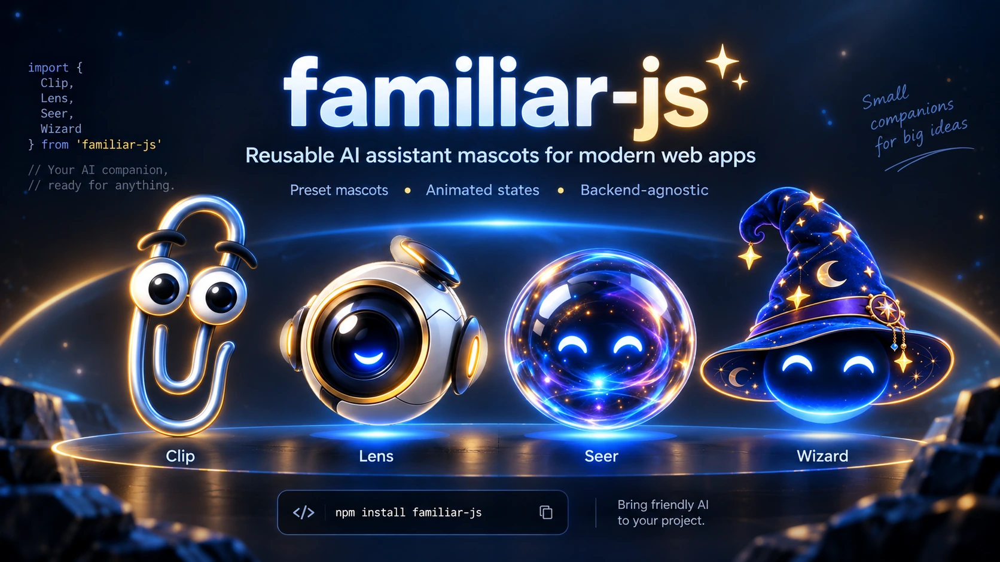
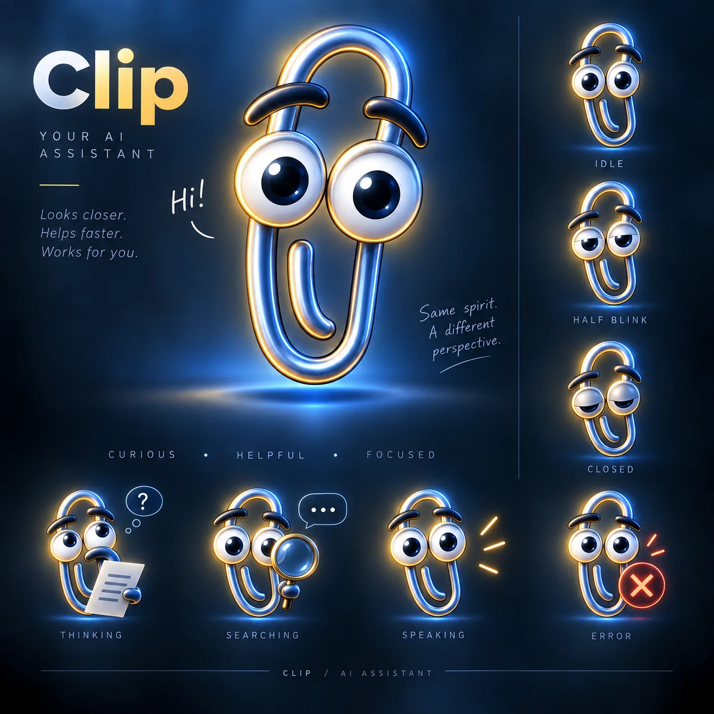
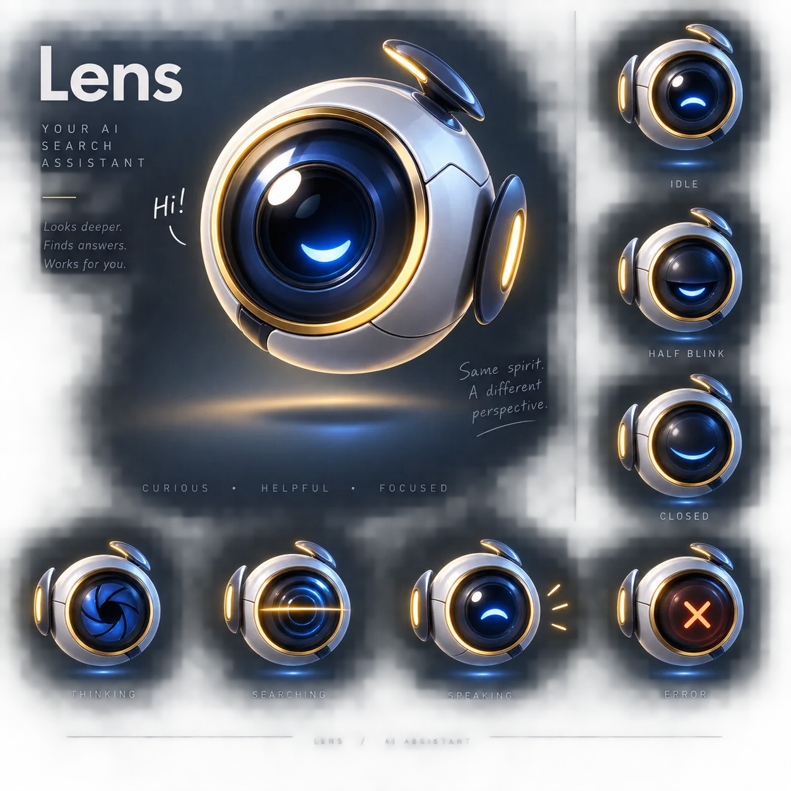
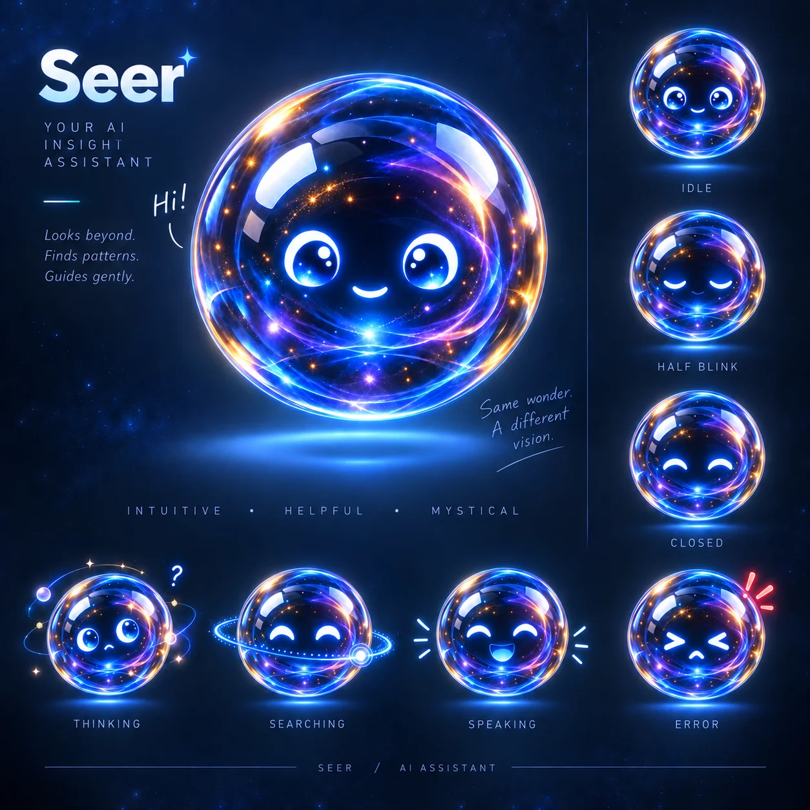
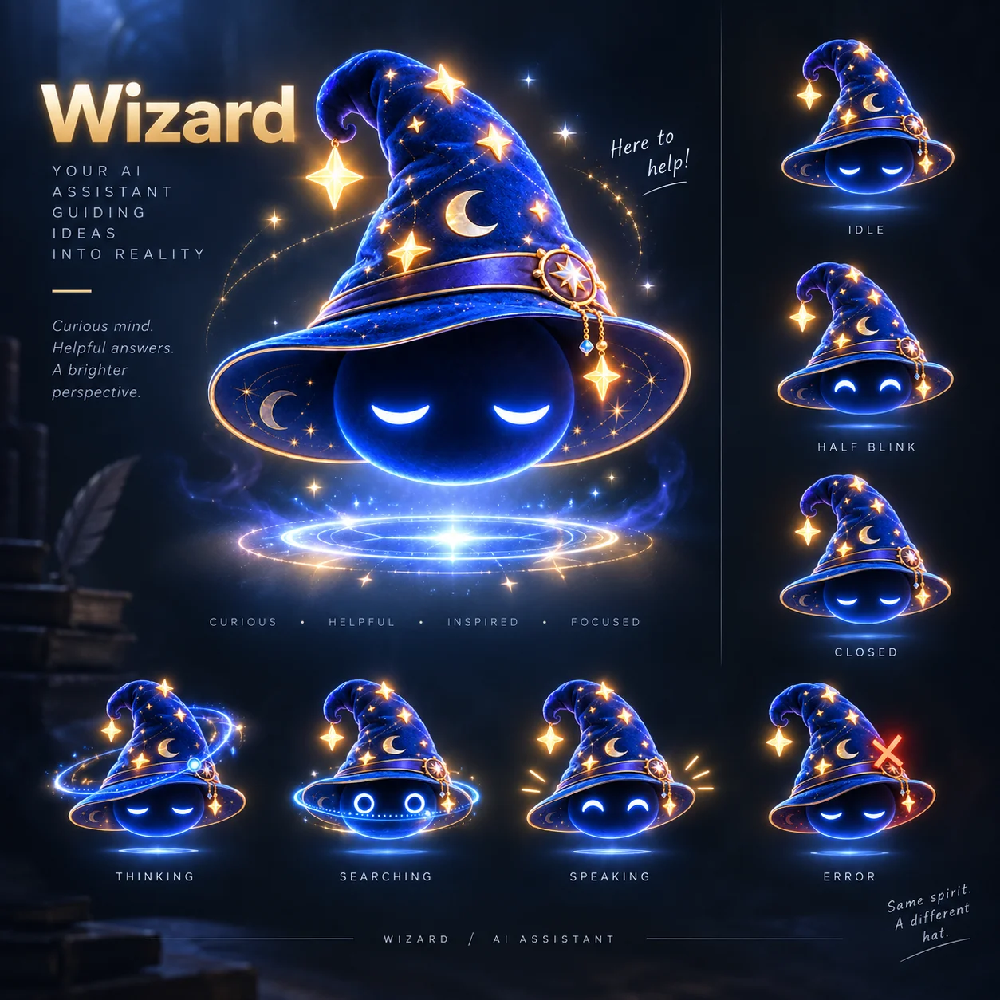

# familiar-js

A lightweight, reusable AI assistant widget with configurable mascot personas, animated states, and pluggable backends.

<p align="center">
  
</p>

<p align="center">
  
  
</p>

`familiar-js` renders a floating launcher and conversational panel — with suggested questions, light/dark/auto theming, a mobile-responsive layout, and keyboard/screen-reader support — while staying completely decoupled from any AI provider. It separates mascot visuals, interaction state, and UI behavior from the actual backend call, so you can plug in a RAG endpoint, an LLM API, or any custom transport.

> **Status:** Early development. Published to npm as [`familiar-js`](https://www.npmjs.com/package/familiar-js) — APIs may still change between releases.

## Features

- Four built-in mascot presets (`Clip`, `Lens`, `Seer`, `Wizard`), each fully swappable per-state artwork
- Animated visual states — `idle`, `hover`, `thinking`, `open`, `error` — with an idle-only blink cycle
- Respects `prefers-reduced-motion` (disables the blink loop) and `prefers-color-scheme` (auto theme)
- Backend-agnostic `Transport` interface, with a built-in `HttpTransport` for simple JSON endpoints
- Suggested-question chips and a built-in "Change mascot" picker (optional, on by default)
- Responsive layout (mobile breakpoint), and a focus-trapped, keyboard-navigable panel with an `aria-live` announcer
- Plain class API (`FamiliarAssistant`) plus a `<familiar-assistant>` custom element for markup-only usage
- Ships as ESM + UMD with type declarations; no framework required

## Installation

```bash
npm install familiar-js
```

Or, to work against the latest unreleased changes, install directly from a git checkout or a local `npm pack` tarball.

## Quick Start

```ts
import { FamiliarAssistant } from 'familiar-js'
import 'familiar-js/styles.css'

const assistant = new FamiliarAssistant({
  endpoint: '/api/assistant',
  mascot: 'Clip',
  title: 'Ask Clip',
  greeting: 'What would you like to know?',
  suggestions: ['What is this?', 'How do I get started?'],
})

// assistant.toggle() / assistant.setMascot('Lens') / assistant.destroy()
```

`endpoint` is POSTed a normalized `{ question, conversation }` payload and expects back `{ answer, sources? }`. Supply a custom `transport` instead if you need different request/response shapes (see [Backend Integration](#backend-integration)).

### Markup-only usage

```html
<script type="module">
  import { registerFamiliarAssistantElement } from 'familiar-js'
  registerFamiliarAssistantElement()
</script>

<familiar-assistant endpoint="/api/assistant" mascot="Clip" title="Ask Clip"></familiar-assistant>
```

The custom element only exposes attribute-friendly config (`endpoint`, `title`, `position`, `greeting`, `theme`, `mascot`, `suggestions`). Use the `FamiliarAssistant` class directly for a custom `transport`, `mascotAssets`, or anything else not expressible as an HTML attribute — it remains the primary, fully-featured integration path.

## Mascot Presets

<table>
  <tr>
    <td align="center" width="160">
      <br />
      <strong>Clip</strong><br />
      Friendly, nostalgic, expressive.
    </td>
    <td align="center" width="160">
      <br />
      <strong>Lens</strong><br />
      Focused, technical, modern.
    </td>
    <td align="center" width="160">
      <br />
      <strong>Seer</strong><br />
      Curious, intuitive, exploratory.
    </td>
    <td align="center" width="160">
      <br />
      <strong>Wizard</strong><br />
      Playful, magical, thoughtful.
    </td>
  </tr>
</table>

Select a preset with `mascot: 'Clip' | 'Lens' | 'Seer' | 'Wizard'` (defaults to `'Clip'`), or switch it live with `assistant.setMascot(preset)`.

## Mascot States

Each preset ships one image per visual state, keyed by `FamiliarMascotState`:

| State | Meaning |
| --- | --- |
| `idle` | Default resting state; runs the blink cycle |
| `hover` | Launcher hovered/keyboard-focused |
| `thinking` | Request in flight |
| `open` | Panel is open |
| `error` | The transport call failed |

Idle additionally cycles through a blink using two extra frames (`eyesClosing`, `eyesClosed`) that aren't part of the state machine above:

```
eyesOpen (3s) → closing (120ms) → closed (220ms) → closing (120ms) → eyesOpen
```

The blink loop is skipped entirely when the browser reports `prefers-reduced-motion: reduce`. Every frame — for any state — can be overridden per-mascot via `mascotAssets`, so a consumer can replace the built-in art wholesale.

## Customization

`FamiliarAssistantConfig` accepts:

| Option | Type | Default |
| --- | --- | --- |
| `endpoint` / `transport` | `string` / `Transport` | — (one is required) |
| `container` | `HTMLElement` | `document.body` |
| `position` | `'bottom-right' \| 'bottom-left'` | `'bottom-right'` |
| `title` | `string` | `'Ask Clip'` |
| `subtitle` | `string` | — |
| `greeting` | `string` | `'What would you like to know?'` |
| `disclosure` | `string` | — |
| `suggestions` | `string[]` | `[]` |
| `theme` | `'light' \| 'dark' \| 'auto'` | `'auto'` |
| `mascot` | `FamiliarMascotPreset` | `'Clip'` |
| `mascotAssets` | `FamiliarMascotAssets` | — |
| `mascotPicker` | `boolean` | `true` |
| `sendHistory` | `boolean` | `true` |
| `historyLimit` | `number` | `10` |
| `openOnLoad` | `boolean` | `false` |
| `headers` | `Record<string, string>` | `{}` |

## Backend Integration

`familiar-js` never talks to an AI/RAG provider directly. It normalizes every question into an `AssistantRequest` (`{ question, conversation }`) and hands it to a `Transport`:

```ts
interface Transport {
  send(request: AssistantRequest, signal?: AbortSignal): Promise<AssistantResponse>
}
```

- Pass `endpoint` to use the built-in `HttpTransport`, which POSTs JSON and expects `{ answer: string, sources?: { title, url? }[] }` back.
- Pass your own `transport` implementing the interface above to connect a streaming endpoint, a custom RAG service, or an LLM API — with full control over request signing and response shaping.
- Throw an `AssistantTransportError` (kinds: `rate-limit`, `network`, `server`, `unknown`) from a custom transport to get the built-in error UI/copy for that failure mode.

Never put provider API keys in frontend code — call your own backend endpoint and keep provider credentials server-side.

## Accessibility

- The launcher is a real `<button>` with `aria-haspopup`, `aria-expanded`, and `aria-label`; the mascot itself is `aria-hidden` (decorative).
- The panel behaves as a focus-trapped dialog: `Escape` closes it, `Tab`/`Shift+Tab` cycle within it, and focus returns to the launcher on close.
- Responses and status changes are announced through an `aria-live="polite"` region.
- The blink animation is disabled under `prefers-reduced-motion: reduce`.

**Roadmap:** full screen-reader pass on the message list and suggestion chips; automated a11y test coverage.

## Project Structure

```
src/
  core/         FamiliarAssistant class, config resolution, shared types
  mascot/       FamiliarMascot renderer, built-in presets, state model
  components/   launcher, panel, message list, suggestions, icons
  transport/    Transport interface + default HttpTransport
  assets/mascot/
    Clip/
    Lens/
    Seer/
    Wizard/
  styles/       CSS tokens and component styles
  web-component.ts
demo/           standalone usage example with a mock transport
tests/          vitest unit tests
```

## Roadmap

- Additional mascot presets and support for custom mascot packs
- Framework wrappers (React/Vue) around the core class
- Streaming response rendering
- Broader accessibility test coverage

## Contributing

See [`CONTRIBUTING.md`](./CONTRIBUTING.md) for the fork/PR workflow and asset contribution guidelines. In short: open an issue or pull request describing the change, and run `npm run lint`, `npm run typecheck`, and `npm test` before submitting.

## License

The `familiar-js` source code is licensed under the MIT License.

Original mascot artwork, mascot state renders, posters, and related visual
assets are licensed separately under Creative Commons Attribution 4.0
International (CC BY 4.0).

Copyright © 2026 Athinodoros Boudourakis.

See [`LICENSE.md`](./LICENSE.md) and [`LICENSE-ASSETS.md`](./LICENSE-ASSETS.md).